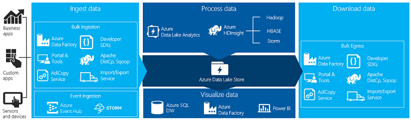
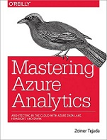

Analyzing StackExchange data with Azure Data Lake
============================================
This repository contains all the code & scripts for my 'Analyzing StackExchange data with Azure Data Lake' talk. This talk highlights the power of Azure Data Lake Store & Analytics and how they can be the center of your big data ecosystem.

During the talk I used a StackExchange data dump to demo the loading, storing, processing and visualizing data with Azure Data Lake Store, Data Lake Analytics & Power BI.

# Getting the data sets
## StackExchange
Stack Exchange has made their data available from all their websites under [Creative Commons](http://creativecommons.org/licenses/by-sa/3.0/) license. It includes data about users, posts, comments, votes, etc for every single site.

This data is used as a demo set since this reflect real-world data. The data contains information about every website by StackExchange going from users & posts to comments and votes and beyond.

Here is an example of how the folder for `coffee-stackexchange-com` is structured: 

	+ coffee-stackexchange-com
		- Badges.xml
		- Comments.xml
		- PostHistory.xml
		- PostLinks.xml
		- Posts.xml
		- Tags.xml
		- Users.xml
		- Votes.xml

You can find the `coffee-stackexchange-com` sample [here](./samples/coffee.stackexchange.com/), download all the data [here](https://archive.org/details/stackexchange) or more information on [StackExchange](https://meta.stackexchange.com/questions/224873/all-stack-exchange-data-dumps).

## Reference data
The demo uses a CSV representing all the countries defined by ISO 3166. This can be found at [lukes/ISO-3166-Countries-with-Regional-Codes](https://github.com/lukes/ISO-3166-Countries-with-Regional-Codes).

## Alternatives
Not a fan of this data set? [caesar0301/awesome-public-datasets](https://github.com/caesar0301/awesome-public-datasets) contains a ton of alternatives.

# Learn more about Data Lakes & Azure Data Lake

- Azure Data Lake GitHub repository ([link](https://azure.github.io/AzureDataLake/))
- U-SQL Documention ([link](http://usql.io/))
- "Introducing Azure Data Lake" Microsoft Virtual Acadamey ([link](https://mva.microsoft.com/en-US/training-courses/introducing-azure-data-lake-17795))
- U-SQL Tutorials ([link](https://saveenr.gitbooks.io/usql-tutorial/))
- Comparison between Azure Blob Storage & Azure Data Lake Store ([link](https://docs.microsoft.com/en-us/azure/data-lake-store/data-lake-store-comparison-with-blob-storage))
- Martin Fowler on Data Lakes ([link](https://bit.ly/martin-fowler-data-lake))
- "Mastering Azure Analytics" by Zoiner Tejada ([link](https://bit.ly/mastering-azure-analytics))

# License
Licensed under the terms of the [MIT license](LICENSE).
